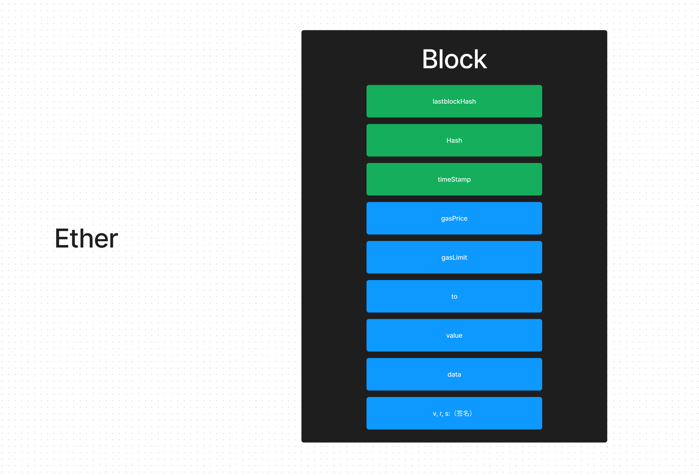

# Web3+人工智能：两峰之间展望未来

## 关于 web3.0

### 我的经历

### 2008《比特币：一种点对点电子现金系统》“中本聪” - PoW(Proof of Work)

- 分布式记账系统的思想,由多个计算机节点组成的网络，这些节点通过一定的协议和算法，共同维护一个公共的、去中心化的账本，记录所有的交易信息和状态变更，实现交易的确认、清算和结算等功能。
- PoW共识奖励机制:打包交易和生成新的区块。


>比特币的 transaction
```javascript
    const bitcoin = require('bitcoinjs-lib');
    const network = bitcoin.networks.testnet; // 使用比特币测试网络

    // 构建交易输入
    const txIn = {
        txId: '0000000000000000000000000000000000000000000000000000000000000000', // 交易哈希
        vout: 0, // 输出序号
        script: '', // 解锁脚本
    };

    // 构建交易输出
    const txOut = {
        address: 'mtk6UZKQf81B8wP6maLpJcKjyL5U9X5df6', // 目标地址
        value: 1000000, // 转入金额（单位是聪，1 BTC = 100000000 聪）
    };

    // 构建交易
    const txb = new bitcoin.TransactionBuilder(network);
    txb.addInput(txIn.txId, txIn.vout);
    txb.addOutput(txOut.address, txOut.value);

    // 签名交易
    txb.sign(0, keyPair); // 使用私钥对输入进行签名

    // 将交易广播到比特币网络中
    const txHex = txb.build().toHex();
    client.sendRawTransaction(txHex, (err, txid) => {
        if (err) {
        console.log(err);
        } else {
        console.log(txid);
        }
    });
```


区块链是由一系列块组成的，每个块都包含了一些交易数据以及前一个块的哈希值。每次新增一个块，都需要对新块中的交易数据进行哈希运算，然后再将该哈希值与前一个块的哈希值进行合并运算，生成当前块的哈希值。因此，随着时间的推移，区块链中的交易数据越来越多，每个块中需要计算的哈希函数也就越来越复杂，需要更多的计算资源和时间。

截至2020年底，比特币网络的全网算力总和约为120 exahashes/秒（EH/s），也就是每秒钟可以进行120万亿次的哈希运算。


比特币网络每年的电力消耗约为110 TWh（太瓦时）。这相当于每秒钟消耗3.5吉瓦特（GW）的电力。以美国的平均电价为0.13美元/千瓦时计算，全网算力每年的电费支出约为14.3亿美元。这个时候的比特币价格在6000美元。

> Stable Diffusion NVIDIA A100 一年3,504千瓦时（kWh）

`
110 TWh = 110,000,000,000 kWh
110,000,000,000 kWh ÷ 1,000 = 110,000,000,000 kWh
110,000,000,000 kWh = 110,000,000,000,000 Wh
110,000,000,000,000 Wh ÷ 3.504 kWh = 31,358,998,860.2

因此，110 TWh等于3,504千瓦时的约31.36万亿倍。
`
比特币在2021年达到6万9千美元峰值。


### 2014 以太网络的出现 维塔利克·布特林 - PoS(Proof of Stake) 
在以太坊之前，比特币是最受欢迎的区块链平台，但比特币只能处理简单的货币交易。维塔利克·布特林希望以太坊能够提供一个更通用的区块链平台，可以在其上构建更复杂的去中心化应用（DApps）。因此，以太坊与比特币不同，它是一种“智能合约”平台，可以让开发者编写程序来控制数字资产，并将其储存在区块链上。

延用了PoW的奖励机制,修改了一系列Block数据结构，设计了虚拟机EVM,发行了Solidity语言

地址不但可以是用户（拥有转账，查账等功能），也可以是一个智能合约（拥有自定义的功能）
使用Solidity语言编写智能合约，并广播到网络后，其他就用就可以和改地址的智能合约进行交互。
```solidity
// SPDX-License-Identifier: MIT

pragma solidity ^0.8.0;

contract Lottery {
    address public manager;
    address payable[] public players;

    constructor() {
        manager = msg.sender;
    }

    function enter() public payable {
        require(msg.value > 0.01 ether, "Minimum amount is 0.01 ether");
        players.push(payable(msg.sender));
    }

    function getPlayers() public view returns (address payable[] memory) {
        return players;
    }

    function random() private view returns (uint256) {
        return uint256(keccak256(abi.encodePacked(block.difficulty, block.timestamp, players.length)));
    }

    function pickWinner() public restricted {
        require(players.length > 0, "There are no players in the lottery");
        uint256 index = random() % players.length;
        players[index].transfer(address(this).balance);
        players = new address payable[](0);
    }

    modifier restricted() {
        require(msg.sender == manager, "Only the manager can call this function");
        _;
    }
}
```
区块链2.0时代，也是web3.0的元年，DAPP开始大量出现。
- ChainLink 是一个去中心化的预言机网络，它为区块链上的智能合约提供了安全可靠的外部数据源。
- Arweave（AR）：Arweave是一个去中心化的永久性存储网络，它使用IPFS和区块链技术来实现数据的安全存储和检索。Arweave使用区块链技术来记录数据的指纹，并将指纹存储在区块链上，以保证数据的完整性和可验证性。Arweave还使用加密货币AR作为激励机制来奖励参与网络的节点。
- andmore....
  
2022年以太坊开始进行Ether2.0升级，正式开始从PoW共识模式转换成PoS模式（与PoW（Proof of Work）不同，它不需要参与者进行大量的计算工作来竞争获得下一个区块的权利。相反，PoS机制通过锁定一定数量的代币（或称为权益），来决定参与者被选为下一个区块的概率）。

Dapp目前的主要应用方向是金融业和游戏业(nft)

### PoUW(Proof of Useful Work)

是基于PoW（Proof of Work）共识机制的改进版。与PoW不同的是，PoUW不是通过计算难题来解决共识的问题，而是要求参与者执行有用的工作来参与共识过程。

PoUW的基本原理是，将有用的工作（如图像识别、语音识别、自然语言处理等）分配给节点，并要求节点提供处理结果的证明。这些证明会被验证和记录到区块链中，以证明节点的贡献。与PoW不同的是，PoUW的工作是有用的，因此它不会像PoW一样浪费大量的计算资源。

能够利用闲置的计算资源。由于PoUW的工作是有用的，因此它可以使用闲置的计算资源来参与共识过程。
更环保。与PoW不同的是，PoUW不需要大量的计算资源来解决难题，因此它比PoW更环保。
有用的工作。PoUW的工作是有用的，因此它可以为人类社会提供一些有用的服务，如图像识别、语音识别等。

Golem Network：Golem Network是一个基于去中心化计算的网络，它允许用户出租或购买计算资源。它使用了类似于PoUW的共识机制，用户可以通过提供计算资源来赚取代币。旨在成为一个全球化的超级计算机网络，可以用于处理各种计算密集型任务，包括人工智能和机器学习等。

iExec：iExec是一个基于去中心化计算的平台，它允许用户购买和出售计算资源。它使用了类似于PoUW的共识机制，用户可以通过提供计算资源来赚取代币。iExec专注于提供安全、高效、可靠的计算资源，用于人工智能、机器学习等各种应用场景。

### 区块链和人工智能带来的资本高度集中

uniswap 129亿 9人
区块链=财务，会计，银行
人工智能 = 业务

### 最后的彩蛋都市传说